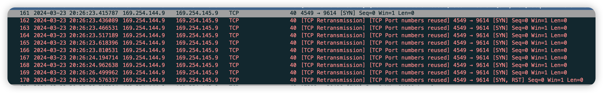

Lab 4 Writeup
=============

If you failed all tcp in IP tests but passed all other tests, and your wireshark output looks like the following, you need to disable your ufw

My name: [your name here]

My SUNet ID: [your sunetid here]

This lab took me about [n] hours to do. I [did/did not] attend the lab session.

I worked with or talked about this assignment with: [please list other sunetids]

Program Structure and Design of the TCPConnection:
[]

Implementation Challenges:
[]

Remaining Bugs:
[]

- Optional: I had unexpected difficulty with: [describe]

- Optional: I think you could make this lab better by: [describe]

- Optional: I was surprised by: [describe]

- Optional: I'm not sure about: [describe]
